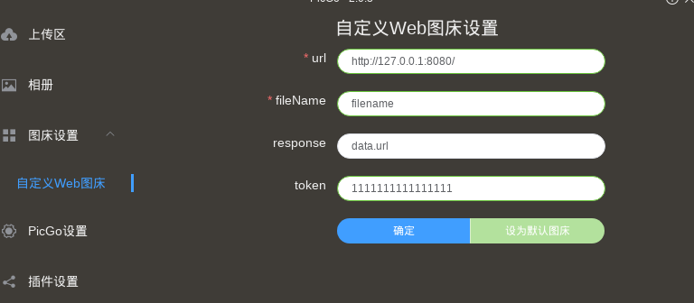

# PicBedroom
自用的图床解决方案

# 配置
* [PicGo客户端](https://github.com/Molunerfinn/picgo)
* [PicGo-web-uploader插件](https://github.com/yuki-xin/picgo-plugin-web-uploader)
* Server.php服务端, 要求php7+, swoole 4+
* Redis

# 安装
* PicGo客户端配置插件
客户端*nix环境的配置文件存放在~/.config/picgo目录, 客户端插件里搜索对应的web-uploader插件，安装后将index.js替换或者二次修改．注意上行参数的设置

* 服务端配置
这里采用的是swoole开发的web server, 可自行扩增请求认证等功能. 也可以使用nginx替换web server服务．

# screenshot

